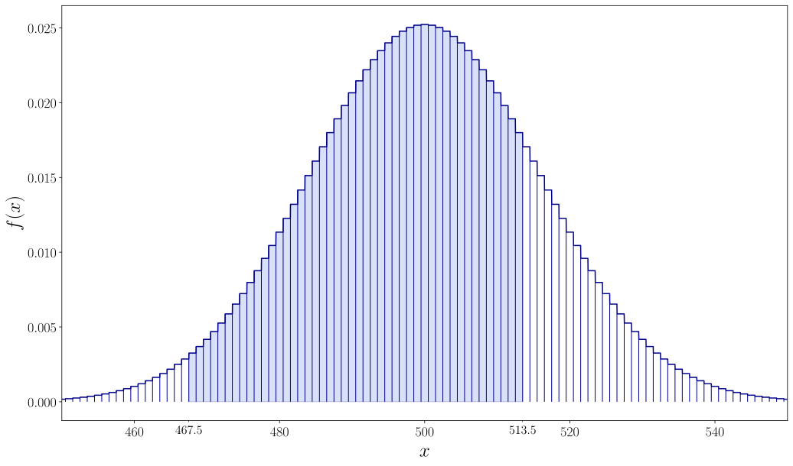

# Overview

Course for DSBA students of the HSE, that introduces basic concepts of probability theory and statistics. The topics include the definitions of probability, Central Limit Theorem, distributions of random variables, estimators, hypotheses testing and their applications. The course contains a variety of practical exercises with solutions and essential theory.

# Materials
:::{#materials}
:::

